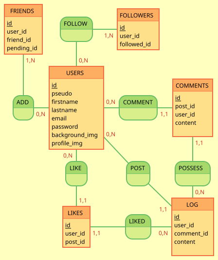

# MimirLog

MimirLog is a personal project aimed at developing a social network. This project leverages several modern technologies to create a robust and scalable application.

## Table of Contents

- [Features](#features)
- [Technologies Used](#technologies-used)
- [Data Model (MCD)](#data-model-mcd)
- [Getting Started](#getting-started)
  - [Prerequisites](#prerequisites)
  - [Installation](#installation)

## Features

- User authentication and authorization
- Post creation, editing, and deletion
- Commenting and liking posts
- Friend and follower system

## Technologies Used

- **Docker**: To containerize the project for consistent development and deployment environments.
- **MySQL**: For database management (considering a switch to PostgreSQL).
- **PHP and Laravel**: For backend development, leveraging Laravel's powerful features and ecosystem.
- **Vue.js 3**: For frontend development, providing a dynamic and responsive user interface.

## Data Model (MCD)



**USERS**: Represents the users of the application. Each user has basic information such as a username, first name, last name, email, password, and profile and background images.

**POSTS**: Manages the posts created by users. Each post is associated with a user and can contain text or other types of content.

**COMMENTS**: Stores comments made on posts. Each comment is linked to a post and a user.

**LIKES**: Records "likes" on posts. Each "like" is associated with a user and a post.

**FRIENDS**: Manages friendship relationships between users. A friendship relationship can be pending (`pending_id`).

**FOLLOWERS**: Manages follow relationships between users. A user can follow multiple other users.

### Relationships

- A user can create multiple posts, comments, and likes.
- A post can have multiple comments and likes.
- Users can have multiple friends and follow multiple other users.

This model helps structure the basic social interactions within the application, facilitating data management and relationships between users.

## Getting Started

### Prerequisites

- Docker and Docker Compose
- Composer (for PHP dependency management)
- Node.js and npm (for frontend dependency management)

### Installation

1. **Clone the repository**:

   ```bash
   git clone https://github.com/BertrandTang/MimirLog.git
   cd mimirlog
